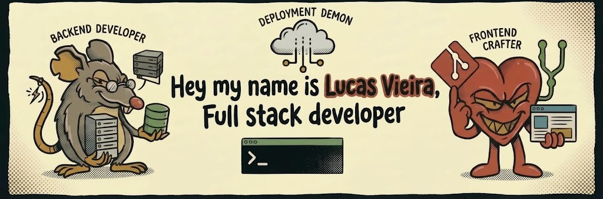

<!-- Crie um repositório PÚBLICO chamado exatamente "lvieiradev" (igual ao seu usuário) e coloque este arquivo como README.md -->

<!-- Troque por um banner seu (1200x300 fica bom). Pode gerar no Canva/Figma e subir no próprio repositório -->

 

# Olá, eu sou o Lucas! 👋

**Estudante de programação · Desenvolvedor Web · Suporte de TI**

---

## >_ Sobre mim

- 🎓 **Formação:** _(Gestão de T.I / FATEC)_
- 💼 **Estágio:** PROATI — suporte técnico, desenvolvimento e gestão de dispositivos
- 🌱 **Estudando agora:** _(ex.: Java, C++)_
- 🔥 **Meta:** programar todos os dias e manter a sequência de contribuições
- 📫 **Contato:** _(l.vieirasdev@gmail.com)_

> Dica: fixe (pin) até 6 repositórios no seu perfil para os melhores aparecerem no topo.

## >_ Tecnologias

<!-- Remova o que você não usa e adicione o que usa. Ícones em https://simpleicons.org -->

## >_ Estatísticas

<!-- Streak igual ao da sua referência -->

  

## >_ Redes

